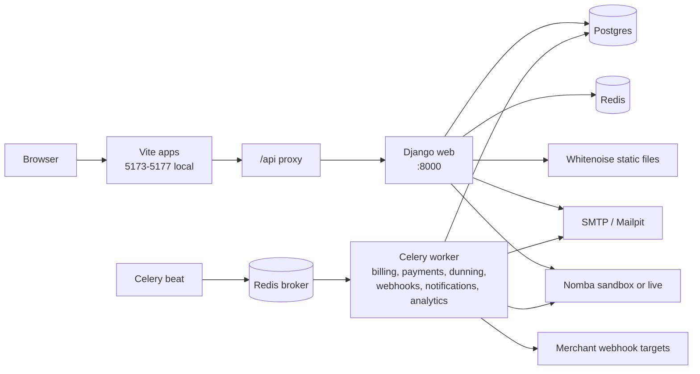
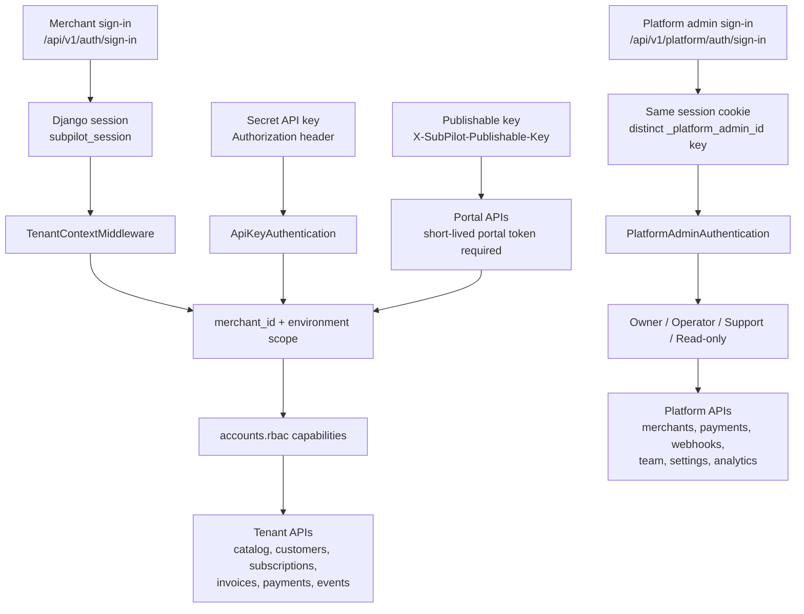
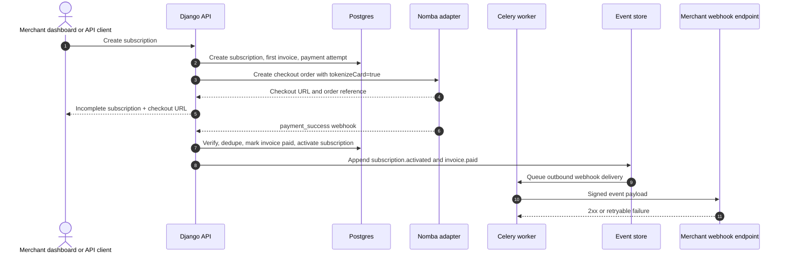
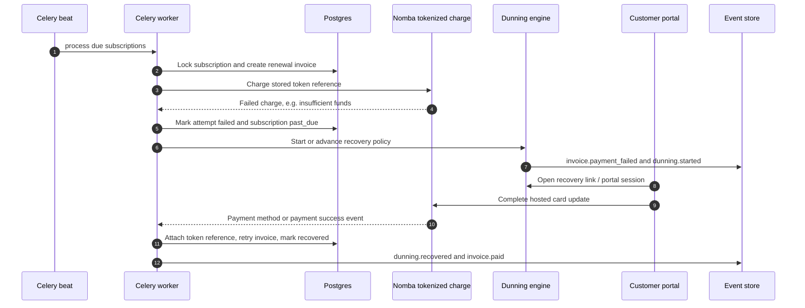
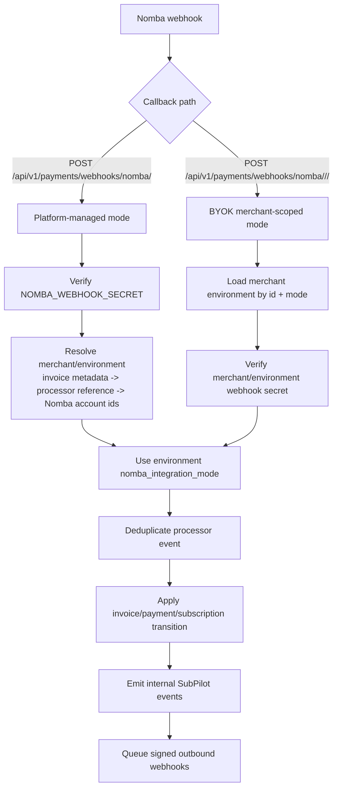
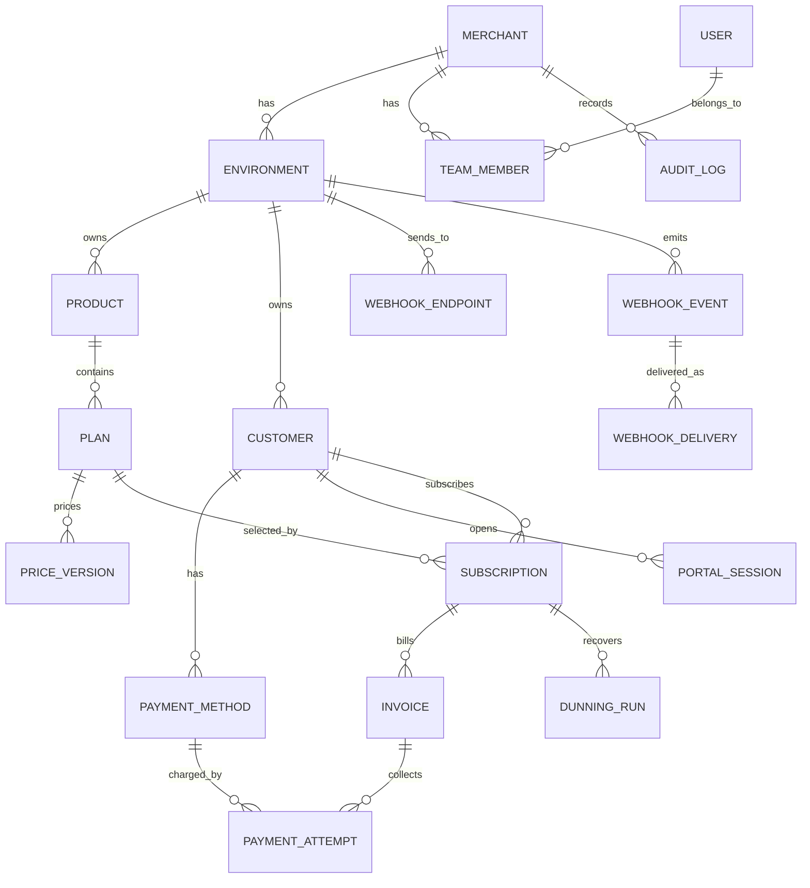

# SubPilot

SubPilot is a subscription billing, recovery, and customer-portal workspace for merchants building on Nomba payment rails. Nomba owns payment primitives such as checkout, tokenized-card charges, and payment webhooks; SubPilot owns subscription state, invoices, retries, dunning, portal sessions, developer APIs, audit logs, and outbound webhooks.

## Architecture

SubPilot is a Django-first monolith with separate React surfaces and package SDKs around it. The monolith keeps tenant-sensitive billing state in one transactional boundary, while Celery handles scheduled billing, dunning, analytics refresh, and webhook delivery.

### System Architecture

```mermaid
flowchart TB
  subgraph Users["Users and Integrators"]
    MerchantUser["Merchant team"]
    CustomerUser["Subscriber / customer"]
    PlatformUser["SubPilot operator"]
    Developer["Merchant backend / developer"]
  end

  subgraph Frontends["React Frontends"]
    Landing["Landing page\napps/landing-page"]
    MerchantDash["Merchant dashboard\napps/merchant-dashboard"]
    CustomerPortal["Hosted customer portal\napps/customer-portal"]
    PlatformAdmin["Platform admin\napps/subpilot-admin"]
    PortalDemo["Embedded portal demo\napps/portal-demo"]
  end

  subgraph Packages["Client Packages"]
    PortalJS["@subpilot/portal-js"]
    PythonSDK["subpilot Python SDK"]
    UI["@subpilot/ui"]
  end

  subgraph Backend["Django API Monolith"]
    Auth["accounts\nAuth, RBAC, tenants, API keys"]
    Catalog["catalog\nProducts, plans, prices"]
    Customers["customers\nCustomers, payment methods, portal sessions"]
    Subs["subscriptions\nLifecycle and billing state"]
    Invoices["invoices\nInvoices, lines, receipts"]
    Payments["payments\nNomba adapters and attempts"]
    Dunning["dunning\nRetries and recovery"]
    Events["events\nEvent store and outbound webhooks"]
    Analytics["analytics\nDashboard metrics"]
    Audit["audit\nImmutable audit logs"]
    Platform["platform_admin\nOperator control plane"]
  end

  subgraph Infra["Infrastructure"]
    Postgres[("Postgres")]
    Redis[("Redis")]
    Worker["Celery worker"]
    Beat["Celery beat"]
    Email["SMTP / Mailpit"]
  end

  subgraph External["External Systems"]
    Nomba["Nomba APIs\nCheckout, tokenized charge, webhooks"]
    MerchantWebhook["Merchant webhook endpoints"]
  end

  MerchantUser --> MerchantDash
  CustomerUser --> CustomerPortal
  PlatformUser --> PlatformAdmin
  Developer --> PythonSDK
  Developer --> PortalJS
  Landing --> MerchantDash
  PortalDemo --> PortalJS
  MerchantDash --> Auth
  MerchantDash --> Catalog
  MerchantDash --> Subs
  MerchantDash --> Invoices
  MerchantDash --> Payments
  MerchantDash --> Dunning
  MerchantDash --> Events
  MerchantDash --> Analytics
  CustomerPortal --> Customers
  CustomerPortal --> Invoices
  CustomerPortal --> Subs
  PlatformAdmin --> Platform
  PortalJS --> Customers
  PythonSDK --> Customers
  PythonSDK --> Subs
  PythonSDK --> Invoices
  UI --> MerchantDash
  UI --> PlatformAdmin

  Auth --> Postgres
  Catalog --> Postgres
  Customers --> Postgres
  Subs --> Postgres
  Invoices --> Postgres
  Payments --> Postgres
  Dunning --> Postgres
  Events --> Postgres
  Analytics --> Postgres
  Platform --> Postgres
  Auth --> Redis
  Events --> Redis
  Beat --> Worker
  Worker --> Subs
  Worker --> Invoices
  Worker --> Payments
  Worker --> Dunning
  Worker --> Events
  Worker --> Analytics
  Worker --> Email
  Payments --> Nomba
  Nomba --> Payments
  Events --> Worker
  Worker --> MerchantWebhook
  Audit --> Postgres
```



### Runtime Deployment



Local compose services live under `backend/docker-compose.yml`: `web`, `worker`, `beat`, `db`, `redis`, `mailpit`, `migrate`, and `collectstatic`.

### Auth, Tenant, and Role Boundaries



Merchant dashboard auth and platform admin auth are intentionally separate domains. Platform admin users are stored in `platform_admin.PlatformAdmin`; merchant users are stored in `accounts.User` with `TeamMember` roles.

### Subscription Billing Flow



### Renewal, Failure, and Recovery Flow



### Nomba Webhook Routing



### Domain Model Map



Architecture rules:

- Django is the source of truth for subscription, invoice, payment, dunning, event, and audit state.
- Every tenant-sensitive record is scoped by merchant and environment, directly or through a parent object.
- Payment provider behavior is isolated behind adapters so mock, sandbox, and live modes share the same domain contract.
- Raw card data never enters SubPilot; the system stores encrypted token references only.
- State transitions that affect money run in database transactions and emit durable events after mutation.
- Outbound webhooks are signed, retryable, and replayable without duplicating the original event.

Main code areas:

| Area | Path |
|---|---|
| Django API | `backend/` |
| Merchant dashboard | `apps/merchant-dashboard/` |
| Platform admin console | `apps/subpilot-admin/` |
| Hosted customer portal | `apps/customer-portal/` |
| Example embedded portal app | `apps/portal-demo/` |
| Public landing site | `apps/landing-page/` |
| Shared React UI | `packages/ui/` |
| Embeddable portal SDK | `packages/portal-js/` |
| Python SDK | `packages/subpilot-python/` |

Deeper design docs:

- [Architecture](docs/technical/architecture.md)
- [Data model](docs/technical/data-model-erd.md)
- [API and webhooks](docs/technical/api-and-webhooks.md)
- [Nomba integration contract](docs/technical/nomba-integration-contract.md)
- [Customer portal SDK](docs/technical/customer-portal-sdk.md)
- [Demo scenario and seed data](docs/delivery/demo-scenario-and-seed-data.md)
- [End-to-end test plan](docs/delivery/end-to-end-test-plan.md)
- [End-to-end QA runbook](docs/delivery/end-to-end-qa-runbook.md)

## URLs

Production or deployed URLs used by the app defaults:

| Surface | URL |
|---|---|
| Public API | `https://api.subpilot.kylodo.com/api/v1` |
| Merchant dashboard | `https://app.subpilot.kylodo.com` |
| Customer portal | `https://portal.subpilot.kylodo.com` |
| Platform admin | `https://platform-admin.subpilot.kylodo.com` |
| Nomba central webhook callback | `https://api.subpilot.kylodo.com/api/v1/payments/webhooks/nomba/` |

Local development URLs:

| Surface | URL | Command |
|---|---|---|
| Django API | `http://localhost:8000` | `docker compose up -d --build` from `backend/` |
| API health | `http://localhost:8000/api/v1/health` | backend stack |
| Swagger docs | `http://localhost:8000/api/docs/` | backend stack |
| Redoc | `http://localhost:8000/api/redoc/` | backend stack |
| Landing site | `http://localhost:5173` | `npm run dev:landing` |
| Merchant dashboard | `http://localhost:5174` | `npm run dev:merchant` |
| Platform admin | `http://localhost:5175` | `npm run dev:admin` |
| Customer portal | `http://localhost:5176` | `npm run dev:customer-portal` |
| Portal SDK demo | `http://localhost:5177` | `npm run dev:portal-demo` |

The current backend compose file runs Mailpit internally but does not publish its UI port. Add a `ports: ["8025:8025"]` mapping to the `mailpit` service if you need the browser UI at `http://localhost:8025`.

## Auth Credentials

These are local demo credentials only. Seed with the commands below so the frontend demo chips, backend users, and E2E scripts all agree.

Shared local demo password:

```text
Subpilot1!
```

MFA bypass code for demo accounts with MFA enabled:

```text
123456
```

Merchant dashboard demo accounts:

| Role | Email | Password | Notes |
|---|---|---|---|
| Owner | `owner@acme.test` | `Subpilot1!` | MFA enabled; main E2E account |
| Finance | `finance@acme.test` | `Subpilot1!` | MFA enabled |
| Support | `support@acme.test` | `Subpilot1!` | No MFA |
| Admin | `admin@fitplus.test` | `Subpilot1!` | MFA enabled |
| New owner | `new@startup.test` | `Subpilot1!` | Onboarding incomplete |

Platform admin console demo accounts:

| Role | Email | Password |
|---|---|---|
| Owner | `owner@subpilot.dev` | `Subpilot1!` |
| Operator | `ops@subpilot.dev` | `Subpilot1!` |
| Support | `support@subpilot.dev` | `Subpilot1!` |

Django admin/operator bootstrap account:

| Email | Password | Purpose |
|---|---|---|
| `admin@example.test` | `Subpilot1!` | Django staff/superuser created by `create_platform_admin` |

## Local Setup

Install frontend dependencies from the repo root:

```bash
npm install
```

Create the backend environment file:

```bash
cp backend/.env.example backend/.env
```

Set these local values in `backend/.env` for the demo and E2E scripts:

```dotenv
DJANGO_SECRET_KEY=local-dev-secret
POSTGRES_PASSWORD=subpilot
FIELD_ENCRYPTION_KEY=Z3DRjAWuNrMK4wYwzL_oS5G2mHxEK4sB-_ucVE9hhxw=
PLATFORM_ADMIN_EMAIL=admin@example.test
PLATFORM_ADMIN_PASSWORD=Subpilot1!
DEMO_MFA_BYPASS_CODE=123456
CORS_ALLOWED_ORIGINS=http://localhost:5173,http://localhost:5174,http://localhost:5175,http://localhost:5176,http://localhost:5177,http://127.0.0.1:5173,http://127.0.0.1:5174,http://127.0.0.1:5175,http://127.0.0.1:5176,http://127.0.0.1:5177
FRONTEND_MERCHANT_URL=http://localhost:5174
FRONTEND_CUSTOMER_URL=http://localhost:5176
FRONTEND_PLATFORM_URL=http://localhost:5175
NOMBA_CHECKOUT_CALLBACK_URL=http://localhost:5174/payments/nomba/callback
```

The `FIELD_ENCRYPTION_KEY` above is the deterministic test key used by the backend test settings. Generate a fresh local Fernet key before using encrypted fields beyond the throwaway demo:

```bash
python -c "from cryptography.fernet import Fernet; print(Fernet.generate_key().decode())"
```

Start the backend stack:

```bash
cd backend
docker network create dokploy-network
docker compose up -d --build
```

If the Docker network already exists, `docker network create dokploy-network` can be skipped.

Seed local demo data:

```bash
cd backend
docker compose exec web python manage.py seed_auth --password 'Subpilot1!'
docker compose exec web python manage.py seed_demo --password 'Subpilot1!'
docker compose exec web python manage.py seed_platform_admins --password 'Subpilot1!'
docker compose exec web python manage.py create_platform_admin --email admin@example.test --password 'Subpilot1!'
```

Start frontend apps from the repo root. Set `VITE_DEMO_PASSWORD` so the sign-in demo chips prefill the password field:

```bash
VITE_DEMO_PASSWORD='Subpilot1!' npm run dev:merchant
VITE_DEMO_PASSWORD='Subpilot1!' npm run dev:admin
npm run dev:customer-portal
npm run dev:portal-demo
npm run dev:landing
```

Run one app per terminal, or use your process manager of choice.

## API Surface

All Django app routes are mounted below `/api/v1/`.

Core routes:

| Domain | Routes |
|---|---|
| Health | `GET /api/v1/health` |
| Merchant auth | `/api/v1/auth/sign-up`, `/sign-in`, `/sign-out`, `/verify-email`, `/request-reset`, `/reset-password`, `/verify-mfa`, `/me` |
| Merchant workspace | `/api/v1/me/features`, `/onboarding/*`, `/workspace-settings/*`, `/signing-keys/*`, `/api-keys/`, `/team-members/` |
| Nomba integration settings | `/api/v1/nomba/`, `/nomba/validate/`, `/nomba/activate/`, `/nomba/accounts/sync/`, `/nomba/sub-account/`, `/nomba/banks/`, `/nomba/bank-account/lookup/` |
| Catalog | `/api/v1/products/`, `/plans/`, `/price-versions/` |
| Customers and portal sessions | `/api/v1/customers/`, `/payment-methods/`, `/portal-sessions/` |
| Subscriptions | `/api/v1/subscriptions/` |
| Invoices | `/api/v1/invoices/` |
| Payments | `/api/v1/payment-attempts/` |
| Dunning | `/api/v1/dunning-policies/`, `/dunning-runs/` |
| Events and outbound webhooks | `/api/v1/webhook-endpoints/`, `/events/`, `/webhook-deliveries/` |
| Analytics | `/api/v1/analytics/overview`, `/analytics/overview/live` |
| Audit | `/api/v1/audit-logs/` |
| Customer portal | `/api/v1/portal/context`, `/plans`, `/subscribe`, `/invoices`, `/payment-methods`, subscription and invoice actions |
| Platform admin | `/api/v1/platform/auth/*`, `/platform/overview`, `/platform/merchants`, `/platform/payments`, `/platform/webhooks/*`, `/platform/api-keys`, `/platform/tickets`, `/platform/team`, `/platform/settings`, `/platform/analytics`, `/platform/audit-log` |

OpenAPI is served at:

```text
http://localhost:8000/api/schema/
http://localhost:8000/api/docs/
http://localhost:8000/api/redoc/
```

## Nomba Webhooks

SubPilot supports two Nomba integration modes:

| Mode | Callback path | Use |
|---|---|---|
| Platform-managed | `POST /api/v1/payments/webhooks/nomba/` | SubPilot owns the platform Nomba credentials and routes events to merchants from invoice metadata, processor references, or Nomba account identifiers. |
| BYOK / merchant-scoped | `POST /api/v1/payments/webhooks/nomba/<merchant_id>/<mode>/` | A merchant environment uses its own Nomba credentials. `mode` is normally `test` or `live`. |

For local Nomba webhook testing, expose the backend through a public HTTPS tunnel and submit the tunnel URL plus one of the paths above to Nomba. Localhost is not reachable by Nomba.

The Nomba adapter contract lives in `docs/technical/nomba-integration-contract.md`. The implementation is under `backend/apps/payments/adapters/` and `backend/apps/payments/integrations/nomba/`.

## End-to-End Demo

The happy path uses Acme Learning Hub in test mode:

1. Sign into the merchant dashboard at `http://localhost:5174` as `owner@acme.test` / `Subpilot1!`.
2. Complete MFA with `123456`.
3. Review dashboard metrics, plans, customers, subscriptions, invoices, dunning runs, and webhook events.
4. Open the platform admin at `http://localhost:5175` as `owner@subpilot.dev` / `Subpilot1!`.
5. Inspect merchants, payments, webhook health, support tickets, KYC, settings, analytics, and audit logs.
6. Open the customer portal at `http://localhost:5176` or the embeddable portal demo at `http://localhost:5177`.
7. Show Nomba integration settings and webhook callback paths.
8. Close with the architecture, ERD, and state-machine docs.

Run the merchant API smoke test:

```bash
cd backend
python scripts/e2e_smoke.py
```

Run the platform admin E2E script:

```bash
cd backend
python scripts/platform_admin_e2e.py
```

If you execute from outside Docker and the backend is not on `localhost:8000`, pass `BASE_URL`:

```bash
BASE_URL=http://localhost:8000 python scripts/e2e_smoke.py
BASE_URL=http://localhost:8000 python scripts/platform_admin_e2e.py
```

For manual QA and demo sign-off, use `docs/delivery/end-to-end-qa-runbook.md`.

## Verification Commands

Frontend:

```bash
npm run typecheck
npm run build
```

Backend:

```bash
cd backend
docker compose exec web pytest
docker compose exec web ruff check .
```

Targeted backend checks:

```bash
cd backend
docker compose exec web pytest apps/payments/tests/test_nomba_webhook_signature.py
docker compose exec web pytest apps/platform_admin/tests/test_auth.py
docker compose exec web pytest apps/accounts/tests/test_nomba_integration_api.py
```

## Notes

- Do not commit real Nomba credentials, production secrets, or generated `.env` files.
- Store raw money values in integer minor units.
- Keep Nomba calls behind adapters so mock, sandbox, and live modes share one interface.
- Every billing, invoice, payment, and webhook state transition should be idempotent and audit logged.
