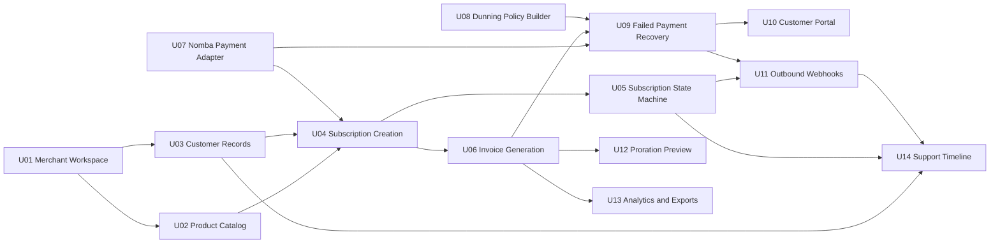

# Build Unit Dependency and Test Contracts

This document turns the feature breakdown into implementation-ready contracts. It should be used with the Django implementation blueprint and the backlog when deciding what to build, test, and demo first.

## Dependency Map

## Slice Gate Rules

| Slice | Must work before moving on | Evidence |
|---|---|---|
| Sellable Plan | Merchant can create product, plan, price version, billing cycle, and dunning policy | Plan Builder screen, `POST /plans`, plan activation test |
| Subscribe and Activate | API creates subscription, checkout session, first invoice, tokenized payment method, and activation event | Subscription Detail timeline, Nomba mock event, outbound webhook log |
| Renew and Recover | Renewal invoice fails, dunning starts, portal session updates card, retry succeeds | Recovery Queue, Customer Portal, invoice paid state |
| Operational Confidence | Admin can explain what happened and developer can replay events | Support timeline, Developer Console, dashboard metrics |

## Unit Contracts

### U01 Merchant Workspace

**Depends on:** none.

**Blocks:** every other unit.

**Implementation contract:**

- Every model that stores merchant data has `merchant_id` and `environment`.
- API keys are hashed, scoped, and cannot be viewed after creation.
- Test and live environments use separate processor credentials and event streams.

**Tests:**

- API key from Merchant A cannot read Merchant B data.
- Test key cannot access live records.
- Revoked key returns unauthorized.

**Demo proof:** switch between Test and Live and show different API keys/webhook endpoints.

### U02 Product Catalog

**Depends on:** U01.

**Blocks:** U04, U06, U12, U13.

**Implementation contract:**

- Active prices are immutable.
- Plan activation requires at least one price version and one billing interval.
- Custom intervals persist as `interval_unit` plus `interval_count`.
- Plan checkout settings include whether card tokenization is required for renewals.

**Tests:**

- Cannot edit an active price in place.
- Monthly, annual, and custom cycles calculate next billing date correctly.
- Plan clone creates a draft with a new price version.

**Demo proof:** create a Pro Monthly plan with tokenized-card renewals enabled.

### U03 Customer Records

**Depends on:** U01.

**Blocks:** U04, U07, U09, U10, U14.

**Implementation contract:**

- `external_id` is unique per merchant/environment.
- Payment method API returns brand, last4, expiry, and status only.
- Token references are encrypted and never returned through serializers.

**Tests:**

- Duplicate `external_id` fails inside one merchant but succeeds across merchants.
- Serialized payment method does not include token reference.
- Default payment method uniqueness is enforced.

**Demo proof:** customer profile shows masked card and subscription timeline.

### U04 Subscription Creation

**Depends on:** U01, U02, U03, U07.

**Blocks:** U05, U06, U09, U11, U14.

**Implementation contract:**

- `POST /subscriptions` is idempotent.
- Checkout subscription starts as `incomplete`.
- First invoice is created before checkout.
- Nomba checkout order is created with card tokenization enabled when plan requires renewals.

**Tests:**

- Replaying the same idempotency key returns the same subscription.
- Missing plan, archived plan, or invalid customer is rejected.
- Checkout creation failure leaves a traceable failed payment attempt.

**Demo proof:** API quickstart creates a subscription and returns a checkout URL.

### U05 Subscription State Machine

**Depends on:** U04.

**Blocks:** U06, U09, U11, U14.

**Implementation contract:**

- Valid states are `incomplete`, `trialing`, `active`, `past_due`, `paused`, `canceling`, `canceled`, and `expired`.
- All transitions go through a state-machine service.
- Every transition writes a `SubscriptionEvent`.
- Invalid transitions are rejected with a clear API error.

**Tests:**

- Duplicate payment-success webhook does not activate twice.
- Active can move to past due on failed renewal.
- Canceled subscription cannot resume without resubscribe.

**Demo proof:** timeline shows incomplete to active to past_due to active/recovered.

### U06 Invoice Generation

**Depends on:** U02, U04, U05.

**Blocks:** U09, U12, U13.

**Implementation contract:**

- Monetary values use minor units.
- Renewal invoice uniqueness is enforced by subscription and billing period.
- Invoice finalization freezes line items.
- Receipt data can be rendered without recalculating mutable plan data.

**Tests:**

- Renewal scanner cannot create duplicate invoices for one period.
- Paid invoice cannot be edited.
- Totals include line items, credits, and proration lines.

**Demo proof:** invoice detail shows line items, attempts, state, and receipt action.

### U07 Nomba Payment Adapter

**Depends on:** U01, U03.

**Blocks:** U04, U09, U10.

**Implementation contract:**

- Adapter exposes `mock`, `sandbox`, and `live` implementations behind one interface.
- Nomba secrets never reach frontend or downstream teams.
- Inbound webhooks are signature-verified and deduplicated.
- Failure classification returns `recoverable`, `hard_failure`, or `processor_pending`.

**Tests:**

- Mock adapter can force success, insufficient funds, expired card, and timeout.
- Same webhook payload processed twice has one business effect.
- Tokenized charge errors map to dunning decisions.

**Demo proof:** toggle mock failure and show recovery queue populated.

### U08 Dunning Policy Builder

**Depends on:** U01, U02.

**Blocks:** U09.

**Implementation contract:**

- Retry offsets are stored as ordered policy steps.
- Hard-failure action is separate from recoverable retry sequence.
- Final action supports `pause_access`, `cancel_subscription`, or `mark_uncollectible`.

**Tests:**

- Policy step order validates.
- Invalid negative retry offsets are rejected.
- Policy preview renders expected retry dates.

**Demo proof:** show Default SaaS Recovery policy before simulating failure.

### U09 Failed Payment Recovery

**Depends on:** U05, U06, U07, U08.

**Blocks:** U10, U11, U13, U14.

**Implementation contract:**

- Recoverable failures schedule the next retry.
- Hard failures pause automatic retry until a replacement payment method exists.
- Recovery notification creates a signed portal session.
- Successful recovery updates invoice, subscription, dunning run, and events in one transaction boundary.

**Tests:**

- Insufficient funds schedules retry.
- Expired card creates `requires_payment_method` state.
- Updating card resumes recovery and retries the invoice.

**Demo proof:** recovery queue moves one invoice from failed to recovered.

### U10 Customer Portal

**Depends on:** U03, U07, U09.

**Blocks:** customer-facing demo completeness.

**Implementation contract:**

- Portal session is signed, scoped, and expiring.
- Portal can show active and past-due states.
- Update-card flow uses Nomba checkout/token flow and does not expose raw card fields.
- Customer can pay overdue invoice after updating payment method.

**Tests:**

- Expired portal session cannot access customer data.
- Customer cannot access another customer through modified URL.
- Successful card update changes default method and records audit event.

**Demo proof:** customer opens recovery link, updates card, and sees invoice recovered.

### U11 Outbound Webhooks

**Depends on:** U05, U09.

**Blocks:** downstream developer story.

**Implementation contract:**

- Events are signed with endpoint secret.
- Delivery is at least once.
- Failures retry with backoff.
- Replay preserves original event payload and creates a new delivery attempt.

**Tests:**

- Webhook signature verifies against documented algorithm.
- Failed endpoint retries.
- Replay of existing event creates a new delivery record.

**Demo proof:** Developer Console shows successful delivery and replay action.

### U12 Proration Preview

**Depends on:** U02, U06.

**Blocks:** advanced billing maturity.

**Implementation contract:**

- Preview is side-effect free.
- Effective date can be immediate or next renewal.
- Preview shows unused credit, new charge, net due, and next renewal date.

**Tests:**

- Preview does not mutate subscription or invoice.
- Mid-cycle upgrade generates net charge.
- Mid-cycle downgrade can create credit.

**Demo proof:** admin previews upgrade before confirming.

### U13 Analytics and Exports

**Depends on:** U06, U09.

**Blocks:** dashboard proof.

**Implementation contract:**

- Dashboard metrics come from read models or safe aggregate queries.
- Exports are scoped by merchant/environment.
- Revenue-at-risk uses open failed invoices attached to active/past-due subscriptions.

**Tests:**

- MRR calculation excludes canceled subscriptions.
- Export cannot include another merchant's rows.
- Recovery rate updates after recovered payment.

**Demo proof:** dashboard shows MRR, revenue at risk, and recovered revenue.

### U14 Support Timeline

**Depends on:** U03, U05, U09, U11.

**Blocks:** support/admin confidence.

**Implementation contract:**

- Timeline combines subscription events, invoice events, payment attempts, dunning notifications, portal actions, and webhook deliveries.
- Entries are ordered by event time and include source.
- Sensitive token or processor secrets are never displayed.

**Tests:**

- Timeline contains events from multiple apps in order.
- Support role sees masked details only.
- Timeline query remains merchant-scoped.

**Demo proof:** support can explain a past-due customer without reading logs.

## Cross-Cutting Test Matrix

| Concern | Minimum evidence |
|---|---|
| Multi-tenancy | API, service, and query tests for merchant/environment isolation |
| Idempotency | Subscription creation, checkout callback, payment webhook, invoice retry |
| Money correctness | Minor-unit totals, immutable finalized invoices, proration preview |
| Security | Token encryption, serializer masking, signed portal sessions, webhook signatures |
| State machines | Valid/invalid transitions and duplicate event handling |
| Background jobs | Renewal scan, payment retry, webhook dispatch, portal expiry cleanup |
| UI readiness | Screen spec, wireframe, mockup, state matrix, and redline checklist for each P0 flow |

## Hackathon Demo Trace

1. Open dashboard and show MRR, revenue at risk, and upcoming renewals.
2. Create or open Pro Monthly plan with tokenized-card renewals.
3. Use API quickstart to create subscription.
4. Simulate Nomba checkout success and token attachment.
5. Show subscription activation timeline and outbound webhook delivery.
6. Simulate renewal failure using tokenized-card charge.
7. Open Recovery Queue and explain recoverable versus hard failure.
8. Send portal link and update payment method.
9. Retry invoice and show recovered state.
10. Replay downstream webhook from Developer Console.
