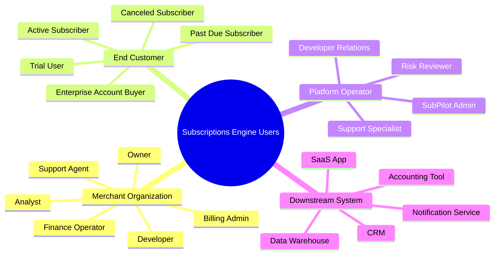

# Users and Stories

## User Type Map

## Primary Personas

### Merchant Owner

Owns revenue and wants to launch recurring plans quickly.

Needs:

- Fast plan setup
- Clear subscription revenue dashboard
- Churn and recovery visibility
- Confidence that customers are charged correctly

### Billing Admin

Manages plans, subscribers, invoices, retries, coupons, credits, and cancellations.

Needs:

- Operational queue of failed payments
- Safe plan changes with proration preview
- Manual retry and payment-link recovery
- Audit trail for every billing event

### Developer

Integrates the subscription engine into a merchant product.

Needs:

- Clear API keys and sandbox
- Idempotent endpoints
- Webhook testing and replay
- SDK-friendly payloads
- Predictable state machines

### Finance Operator

Reconciles payments, invoices, refunds, taxes, and payouts.

Needs:

- Invoice exports
- Transaction matching
- Revenue reporting
- Failed charge reasons
- Refund and credit note trail

### Support Agent

Helps customers understand billing issues.

Needs:

- Customer timeline
- Safe actions: resend payment link, pause, cancel, retry, update email
- Read-only payment method summaries
- Explanation of why a subscription is blocked

### End Customer

Subscribes to a merchant's product and wants control over billing.

Subtypes:

- New subscriber
- Trial user
- Active subscriber
- Past due subscriber
- Canceled subscriber
- Enterprise account buyer

Needs:

- Understand plan price and renewal date
- Pay or update card
- Upgrade or downgrade
- Download receipts
- Cancel, pause, or resume according to merchant policy

### SubPilot Platform Operator

Monitors SubPilot system health, risk, abuse, and merchant success.

Needs:

- Tenant-level visibility
- Webhook delivery diagnostics
- Retry backoff safety
- Rate limiting and abuse controls
- Compliance and audit logs

## Role Permissions

| Role | View | Create/Edit Plans | Manage Subscribers | Refund/Credit | API Keys | Webhooks | Team/RBAC | Support Actions |
|---|---:|---:|---:|---:|---:|---:|---:|---:|
| Owner | Yes | Yes | Yes | Yes | Yes | Yes | Yes | Yes |
| Billing Admin | Yes | Yes | Yes | Limited | No | No | No | Yes |
| Finance | Yes | No | No | Yes | No | No | No | No |
| Developer | Yes | No | No | No | Yes | Yes | No | No |
| Support | Limited | No | Limited | No | No | No | No | Yes |
| Analyst | Read-only | No | No | No | No | No | No | No |
| SubPilot Admin | Scoped platform | No merchant changes by default | Escalated only | Escalated only | No secret reveal | Diagnostics | No | Escalated only |

## User Stories

### Merchant Onboarding

- As a merchant owner, I want to create my first plan with price, interval, trial, and payment methods so that I can sell subscriptions today.
  - Acceptance: A plan can be created in draft, previewed, activated, archived, and cloned.
  - Acceptance: The system prevents editing price/interval on active plans without versioning.

- As a developer, I want sandbox API keys and sample requests so that I can test without moving real money.
  - Acceptance: Sandbox and live environments are separated.
  - Acceptance: Sample curl requests include idempotency keys.

### Plan Management

- As a billing admin, I want to define monthly, annual, and custom billing cycles so that pricing matches my business model.
  - Acceptance: Supported intervals include day, week, month, year, and custom interval count.
  - Acceptance: Plans can include trial days, setup fees, metadata, and feature entitlements.

- As a merchant owner, I want pricing versions so that existing customers are not accidentally moved when a new price launches.
  - Acceptance: Existing subscriptions remain attached to their plan version until migrated.

### Subscription Lifecycle

- As an end customer, I want to start a subscription from checkout so that I can immediately access the merchant product.
  - Acceptance: Checkout creates a pending subscription and first invoice.
  - Acceptance: Successful payment activates the subscription and emits a webhook.

- As a merchant system, I want subscription status webhooks so that I can provision or revoke access.
  - Acceptance: Webhook payload includes merchant, customer, subscription, plan, invoice, event id, and occurred_at.
  - Acceptance: Events are replayable and signed.

### Proration

- As a billing admin, I want a proration preview before changing a subscription so that I can explain charges to customers.
  - Acceptance: Preview shows unused credit, new plan charge, net amount due, effective date, and renewal date.
  - Acceptance: Downgrades can be immediate, end-of-cycle, or credit-only based on merchant policy.

### Dunning

- As a billing admin, I want failed-payment recovery rules so that revenue is recovered without manual chasing.
  - Acceptance: Policy supports retry count, retry spacing, customer notification cadence, final action, and grace period.
  - Acceptance: Failed invoices show reason, attempt count, next attempt, and recovery link.

- As a past due customer, I want a secure self-service link to update payment details so that I can restore access.
  - Acceptance: Link opens a branded customer portal with payment update, invoice payment, and support contact.

### Customer Portal

- As an active subscriber, I want to view my plan, renewal date, receipts, and payment method so that I can self-serve.
  - Acceptance: The portal supports view plan, update payment method, pay invoice, download receipt, cancel, and resume.
  - Acceptance: Portal actions obey merchant policy.

### Finance and Support

- As finance, I want invoice and payment exports so that I can reconcile revenue.
  - Acceptance: Export supports CSV with date range, status, plan, customer, payment reference, and fees.

- As support, I want a customer timeline so that I can answer billing questions quickly.
  - Acceptance: Timeline includes subscription changes, invoice generation, payment attempts, webhooks, notifications, and portal actions.

### Platform Operations

- As a SubPilot platform operator, I want tenant isolation and audit logs so that support and risk reviews are defensible.
  - Acceptance: Every record is scoped by merchant_id and environment.
  - Acceptance: Sensitive operations produce immutable audit events.
