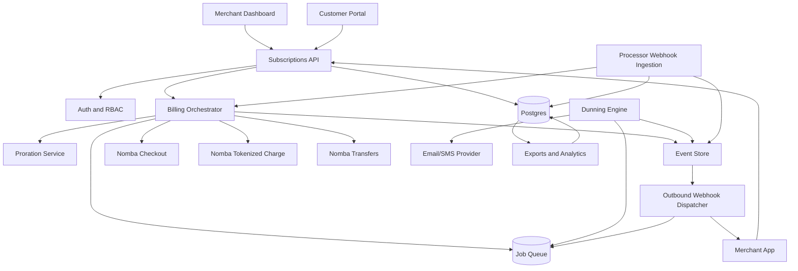
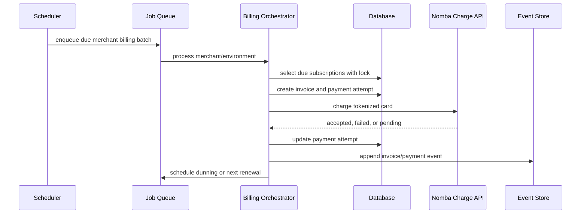

# Architecture

## Architecture Goals

- Wrap Nomba payment primitives in a subscription-domain service.
- Preserve multi-tenant isolation.
- Make every payment and state transition idempotent.
- Use background jobs for billing cycles, retries, and webhooks.
- Keep a complete audit trail.
- Expose ergonomic APIs and webhooks to downstream product teams.

## High-Level Architecture

## Core Services

## Django Implementation Architecture

SubPilot should be implemented as a Django monolith with clear app boundaries. This keeps the hackathon build fast while still giving the product a serious architecture.

Recommended Django apps:

- `accounts`: merchants, environments, team members, RBAC, API keys
- `catalog`: products, plans, price versions, entitlements
- `customers`: customer records, payment method tokens, portal sessions
- `subscriptions`: subscriptions, subscription items, lifecycle state machine
- `invoices`: invoices, invoice line items, credits, receipts
- `payments`: Nomba adapter, payment attempts, processor webhook ingestion
- `dunning`: retry policies, recovery links, notifications, failed-payment jobs
- `events`: internal event store, outbound webhooks, delivery retries
- `audit`: immutable audit logs
- `analytics`: dashboard metrics and exports

Recommended packages:

- Django
- Django REST Framework for merchant, dashboard, and portal APIs
- PostgreSQL for durable billing state
- Celery for billing runs, dunning retries, notifications, and webhook dispatch
- Redis as Celery broker and cache
- django-filter for API filtering
- drf-spectacular for OpenAPI generation
- django-cors-headers if the frontend is separate
- pytest-django for state-machine and API tests

Deployment shape:

- `web`: Django ASGI/WSGI app serving APIs and admin/dashboard backend
- `worker`: Celery worker for billing, payment, notification, and webhook jobs
- `beat`: Celery Beat for scheduled billing and retry scans
- `postgres`: primary relational store
- `redis`: broker/cache

Critical Django rules:

- Put all money values in integer minor units.
- Use `transaction.atomic()` around subscription, invoice, and payment state transitions.
- Use row locks with `select_for_update()` when processing due subscriptions and invoices.
- Keep Nomba calls behind a service adapter so sandbox, mock, and live modes share one interface.
- Store state transitions in append-only event/audit tables before dispatching outbound webhooks.

### Subscriptions API

Responsibilities:

- Public merchant API
- Dashboard API
- Customer portal API
- Idempotency enforcement
- Request validation
- Merchant and environment scoping

### Billing Orchestrator

Responsibilities:

- Create invoices
- Advance subscription periods
- Call Nomba checkout for first payment
- Call Nomba tokenized card charge for renewals
- Apply subscription state transitions
- Schedule next billing run

### Dunning Engine

Responsibilities:

- Interpret dunning policy
- Classify payment failures
- Schedule retries
- Send recovery notifications
- Apply final action after retries
- Pause retries when a new payment method is required

### Proration Service

Responsibilities:

- Preview plan and quantity changes
- Calculate unused credit
- Calculate new charge
- Generate invoice lines
- Apply immediate or end-of-cycle changes

### Webhook Ingestion

Responsibilities:

- Receive Nomba webhooks
- Verify signatures
- Deduplicate by processor event id or request id
- Match payment references
- Update invoice/payment/subscription state
- Store raw payload metadata

### Outbound Webhook Dispatcher

Responsibilities:

- Send events to merchant endpoints
- Sign payloads
- Retry failed deliveries
- Expose replay and diagnostics

## Multi-Tenant Model

Every tenant-sensitive table includes:

- `merchant_id`
- `environment`: test or live
- `created_at`
- `updated_at`

Tenant rules:

- API keys are scoped to one merchant and environment.
- Webhook endpoints are scoped to one merchant and environment.
- Customers are merchant-local. The same email in two merchants is two customer records.
- Nomba account IDs are stored per merchant environment.
- Platform operators need explicit elevated access with audit logging.

## Idempotency Strategy

Idempotency applies to:

- Create subscription
- Create invoice
- Attempt payment
- Change subscription
- Cancel subscription
- Webhook ingestion
- Outbound webhook event delivery

Implementation:

- Require `Idempotency-Key` for mutation endpoints.
- Store method, path, merchant_id, key, request hash, response body, and status.
- Return the original response if the same key and request hash are reused.
- Reject same key with different request hash.

## Billing Job Flow

## Payment State Handling

Processor response and webhook state are separated:

- API response can be synchronous success, synchronous failure, or pending.
- Webhook event confirms final processor outcome.
- The system should tolerate duplicate webhooks.
- The system should not grant access twice.

## Webhook Delivery Guarantees

- At least once delivery.
- Event IDs are unique and stable.
- Payloads include `event_id`, `event_type`, `merchant_id`, `environment`, `occurred_at`, and `data`.
- Merchant systems must dedupe by `event_id`.
- Dispatcher retries with exponential backoff and maximum attempt count.

## Security Architecture

- Dashboard uses RBAC.
- API uses merchant-scoped API keys.
- Customer portal uses signed, expiring portal sessions.
- Webhooks are HMAC signed.
- Processor secrets are encrypted.
- Audit log stores actor, action, target, IP, user agent, and before/after summaries.

## Observability

Required dashboards:

- Billing batch success/failure by merchant
- Payment success/failure rates
- Dunning recovery funnel
- Webhook delivery failure rates
- Queue depth and job latency
- API error rates
- Subscription state distribution

Required alerts:

- Billing batch failure
- Webhook ingestion signature mismatch spike
- Nomba API failure spike
- Dunning queue backlog
- Outbound webhook failure spike
