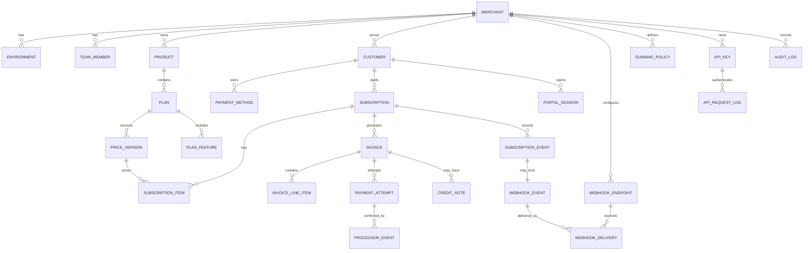

# Data Model and ERD

## ERD

## Table Sketches

### merchants

| Field | Type | Notes |
|---|---|---|
| id | uuid | Primary key |
| name | text | Merchant display name |
| nomba_parent_account_id | text | Nomba account reference |
| status | enum | active, suspended |
| default_currency | text | NGN for MVP |
| created_at | timestamp | |

### environments

| Field | Type | Notes |
|---|---|---|
| id | uuid | Primary key |
| merchant_id | uuid | Tenant scope |
| mode | enum | test, live |
| nomba_account_id | text | Account id used in headers |
| webhook_secret | encrypted text | For outbound signing |

### products

| Field | Type | Notes |
|---|---|---|
| id | uuid | Primary key |
| merchant_id | uuid | Tenant scope |
| name | text | Example: Payroll SaaS |
| description | text | |
| status | enum | active, archived |

### plans

| Field | Type | Notes |
|---|---|---|
| id | uuid | Primary key |
| product_id | uuid | |
| merchant_id | uuid | Tenant scope |
| name | text | Example: Pro |
| description | text | |
| status | enum | draft, active, archived |
| trial_days | integer | Default 0 |
| dunning_policy_id | uuid | Optional override |
| metadata | jsonb | |

### price_versions

| Field | Type | Notes |
|---|---|---|
| id | uuid | Primary key |
| plan_id | uuid | |
| amount_minor | integer | Store kobo, not decimal |
| currency | text | NGN |
| interval_unit | enum | day, week, month, year |
| interval_count | integer | 1 for monthly, 12 for annual-style custom if needed |
| setup_fee_minor | integer | |
| active_from | timestamp | |
| active_to | timestamp | Null means current |

### customers

| Field | Type | Notes |
|---|---|---|
| id | uuid | Primary key |
| merchant_id | uuid | Tenant scope |
| external_id | text | Merchant app reference |
| email | text | |
| name | text | |
| phone | text | |
| metadata | jsonb | |

### payment_methods

| Field | Type | Notes |
|---|---|---|
| id | uuid | Primary key |
| customer_id | uuid | |
| merchant_id | uuid | Tenant scope |
| nomba_token_key | encrypted text | Token only, no raw card |
| brand | text | Visa, Mastercard if available |
| last4 | text | Display only |
| exp_month | integer | Display and expiry detection |
| exp_year | integer | |
| status | enum | active, expired, revoked |
| is_default | boolean | |

### subscriptions

| Field | Type | Notes |
|---|---|---|
| id | uuid | Primary key |
| merchant_id | uuid | Tenant scope |
| customer_id | uuid | |
| status | enum | draft, incomplete, trialing, active, past_due, paused, unpaid, canceling, canceled, expired |
| billing_anchor | date | Renewal anchor |
| current_period_start | timestamp | |
| current_period_end | timestamp | |
| trial_end | timestamp | Optional |
| cancel_at_period_end | boolean | |
| canceled_at | timestamp | |
| default_payment_method_id | uuid | |
| dunning_policy_id | uuid | Override |
| metadata | jsonb | |

### subscription_items

| Field | Type | Notes |
|---|---|---|
| id | uuid | Primary key |
| subscription_id | uuid | |
| price_version_id | uuid | |
| quantity | integer | Default 1 |
| status | enum | active, scheduled, removed |

### invoices

| Field | Type | Notes |
|---|---|---|
| id | uuid | Primary key |
| merchant_id | uuid | Tenant scope |
| customer_id | uuid | |
| subscription_id | uuid | |
| number | text | Merchant-facing |
| status | enum | draft, open, paid, void, uncollectible, refunded, partially_refunded |
| subtotal_minor | integer | |
| discount_minor | integer | |
| tax_minor | integer | MVP can be 0 |
| total_minor | integer | |
| amount_due_minor | integer | |
| currency | text | |
| due_at | timestamp | |
| paid_at | timestamp | |
| hosted_payment_url | text | Recovery link target |

### payment_attempts

| Field | Type | Notes |
|---|---|---|
| id | uuid | Primary key |
| merchant_id | uuid | Tenant scope |
| invoice_id | uuid | |
| payment_method_id | uuid | |
| attempt_number | integer | |
| status | enum | pending, succeeded, failed, requires_action, canceled |
| failure_code | text | |
| failure_message | text | |
| processor_reference | text | Nomba transaction/order reference |
| idempotency_key | text | Unique per attempt |
| next_retry_at | timestamp | |

### dunning_policies

| Field | Type | Notes |
|---|---|---|
| id | uuid | Primary key |
| merchant_id | uuid | Tenant scope |
| name | text | |
| retry_offsets_days | integer[] | Example: 0,1,3,7,14 |
| grace_period_days | integer | |
| final_action | enum | keep_past_due, pause, cancel, mark_unpaid |
| notify_email | boolean | |
| notify_sms | boolean | |
| notify_webhook | boolean | |

### webhook_events

| Field | Type | Notes |
|---|---|---|
| id | uuid | Event id delivered to merchants |
| merchant_id | uuid | Tenant scope |
| environment | enum | test, live |
| event_type | text | |
| aggregate_type | text | subscription, invoice, payment |
| aggregate_id | uuid | |
| payload | jsonb | |
| occurred_at | timestamp | |

### webhook_deliveries

| Field | Type | Notes |
|---|---|---|
| id | uuid | Primary key |
| webhook_event_id | uuid | |
| endpoint_id | uuid | |
| status | enum | pending, succeeded, failed, exhausted |
| attempt_count | integer | |
| last_status_code | integer | |
| last_response_body | text | Truncated |
| next_attempt_at | timestamp | |

## Indexes

- `subscriptions(merchant_id, status, current_period_end)`
- `subscriptions(merchant_id, customer_id)`
- `invoices(merchant_id, status, due_at)`
- `payment_attempts(invoice_id, attempt_number)`
- `webhook_events(merchant_id, event_type, occurred_at)`
- `webhook_deliveries(status, next_attempt_at)`
- `api_request_logs(merchant_id, idempotency_key)`

## Data Integrity Rules

- Active subscriptions must have at least one active subscription item.
- Paid invoices cannot be edited, only credited or refunded.
- A price version cannot be changed after it has subscribers.
- Subscription state transitions must be validated by a state machine.
- Payment attempts are append-only except for status update from pending to terminal.
- Webhook events are append-only.
- Audit logs are append-only.
