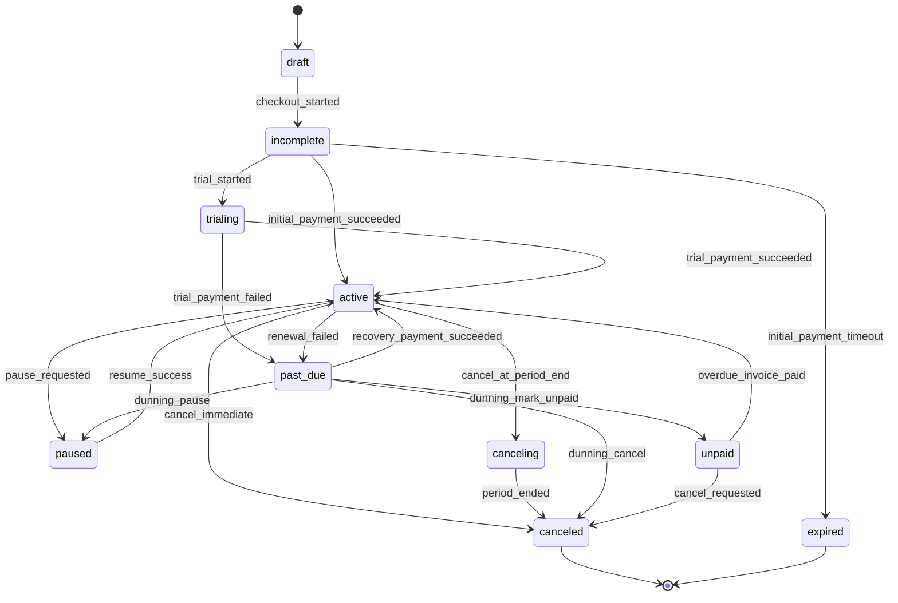
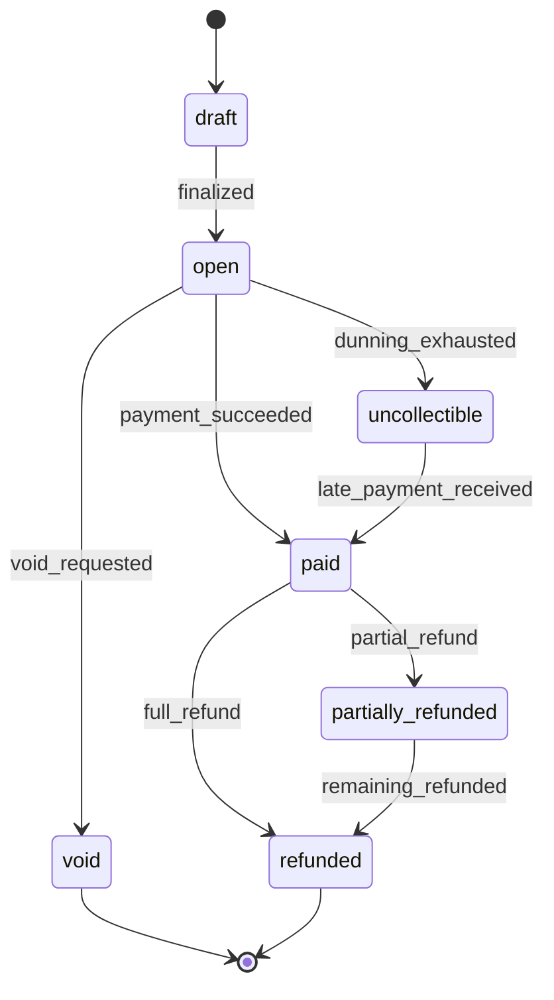
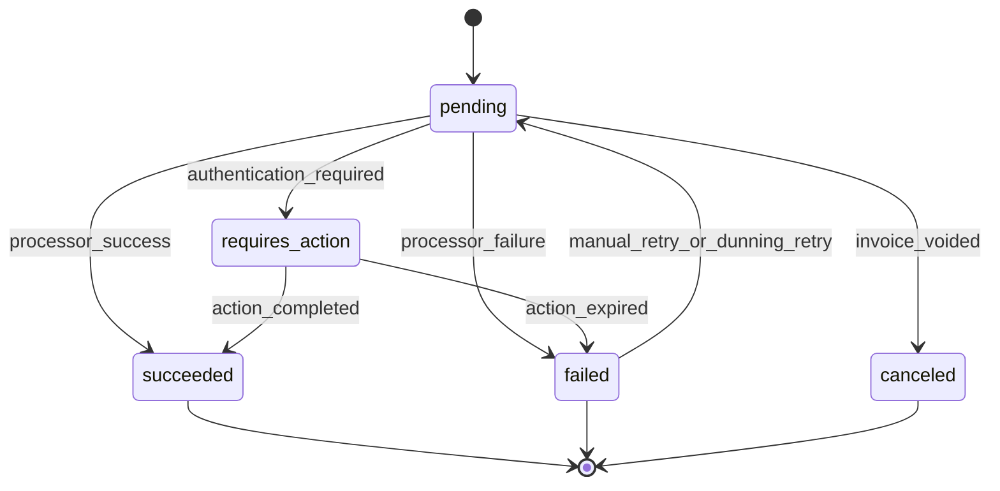
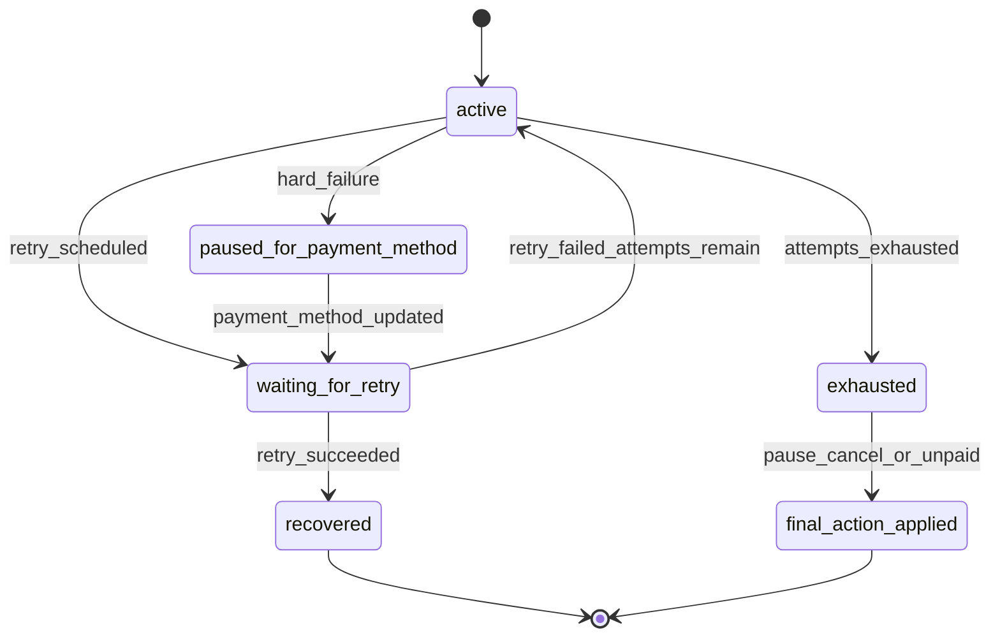
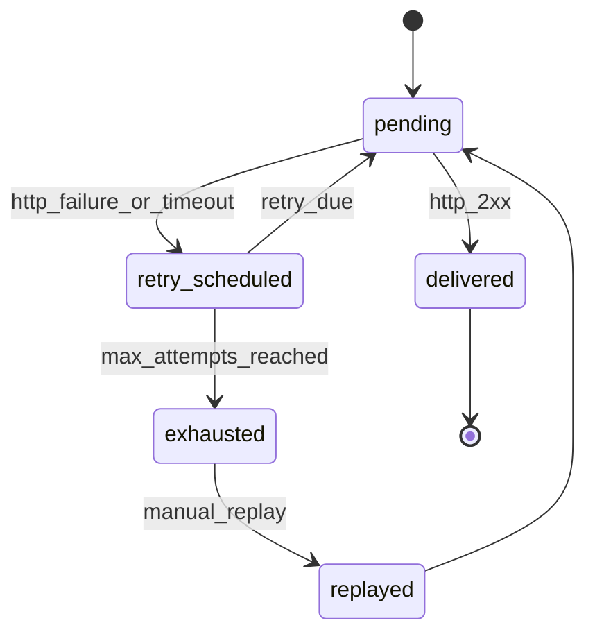

# State Machine Specification

This document defines the state machines SubPilot must implement. It is a key judging artifact because recurring billing is mostly a state-management problem.

## State Machine Principles

- State transitions must be explicit and tested.
- Transitions must be idempotent.
- Terminal states cannot be silently reopened.
- All state transitions append an event and audit record where applicable.
- Payment processor webhooks are untrusted until verified.
- Duplicate and out-of-order processor events must not corrupt billing state.

## Subscription State Machine

### Subscription Transition Table

| From | To | Trigger | Guard | Side Effects |
|---|---|---|---|---|
| `draft` | `incomplete` | Checkout created | Plan active | Create first invoice and payment attempt |
| `incomplete` | `active` | Payment success | Invoice paid | Set current period, emit webhook |
| `incomplete` | `trialing` | Trial started | Plan has trial days | Set trial end, emit event |
| `incomplete` | `expired` | Checkout timeout | No payment | Void first invoice if allowed |
| `trialing` | `active` | Trial payment success | Payment method valid | Create/paid invoice, set period |
| `trialing` | `past_due` | Trial payment failed | Recovery allowed | Start dunning |
| `active` | `past_due` | Renewal failed | Failure recoverable | Start or advance dunning |
| `active` | `paused` | Admin/customer pause | Policy allows pause | Stop access, maybe stop billing |
| `active` | `canceling` | Cancel at period end | Policy allows | Set cancel_at_period_end |
| `active` | `canceled` | Immediate cancel | Confirmed | Revoke access |
| `canceling` | `canceled` | Period ended | Current period ended | Revoke access |
| `paused` | `active` | Resume | Payment method valid | Restore access |
| `past_due` | `active` | Recovery paid | Invoice paid | Mark dunning recovered |
| `past_due` | `paused` | Dunning final action | Policy final_action=pause | Revoke/limit access |
| `past_due` | `unpaid` | Dunning final action | Policy final_action=mark_unpaid | Stop retries |
| `past_due` | `canceled` | Dunning final action | Policy final_action=cancel | Revoke access |

### Invalid Subscription Transitions

- `canceled -> active`
- `expired -> active`
- `draft -> active`
- `unpaid -> trialing`
- `paused -> trialing`
- `canceling -> trialing`

## Invoice State Machine

### Invoice Rules

- Draft invoices can be edited.
- Open invoices can be paid, voided, or marked uncollectible.
- Paid invoices cannot be edited.
- Refunds and credits are separate records, not invoice mutation.
- A late payment on an uncollectible invoice may mark it paid only if merchant policy allows.

## Payment Attempt State Machine

### Failure Classification

| Failure Type | Examples | Retry? | Next Action |
|---|---|---|---|
| Recoverable | Insufficient funds, temporary decline, network timeout | Yes | Schedule retry |
| Hard failure | Expired card, invalid token, revoked token | No | Require payment method update |
| Action required | 3DS or customer authentication needed | Maybe | Send customer action link |
| Processor unavailable | Nomba downtime or timeout | Yes | Retry with backoff |

## Dunning State Machine

### Dunning Rules

- One active dunning run per invoice.
- Dunning run owns the retry timeline.
- Updating payment method can resume paused dunning.
- Final action depends on policy: pause, cancel, mark unpaid, or keep past_due.
- Recovery emits both billing and developer events.

## Webhook Delivery State Machine

### Webhook Rules

- Event creation is separate from delivery.
- Event records are immutable.
- Delivery attempts can retry.
- Manual replay creates a new delivery attempt, not a new source event.
- Payload includes stable `event_id`.

## Idempotency Requirements

Idempotent operations:

- Create subscription.
- Create checkout order.
- Process Nomba webhook.
- Charge renewal invoice.
- Retry failed invoice.
- Emit outbound webhook event.
- Replay webhook delivery.

## Test Matrix

| Area | Required Test |
|---|---|
| Subscription | Invalid transitions rejected |
| Subscription | Duplicate activation webhook does not duplicate activation |
| Invoice | Paid invoice cannot be edited |
| Invoice | Renewal invoice generated once per cycle |
| Payment | Hard failure pauses retries |
| Payment | Recoverable failure schedules retry |
| Dunning | Final action applies after attempts exhausted |
| Dunning | Payment method update resumes recovery |
| Webhooks | Failed delivery retries with backoff |
| Webhooks | Replay does not duplicate source event |
