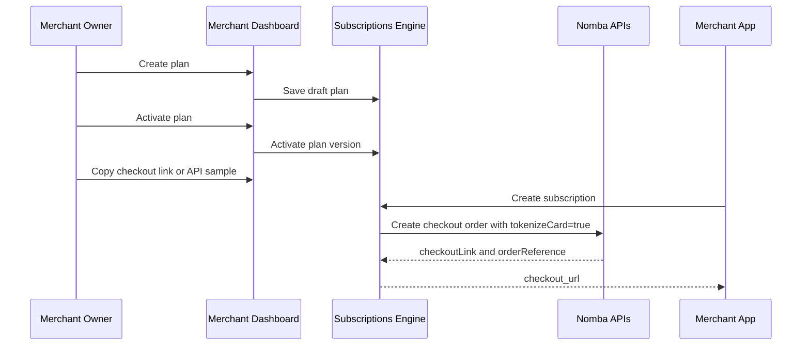
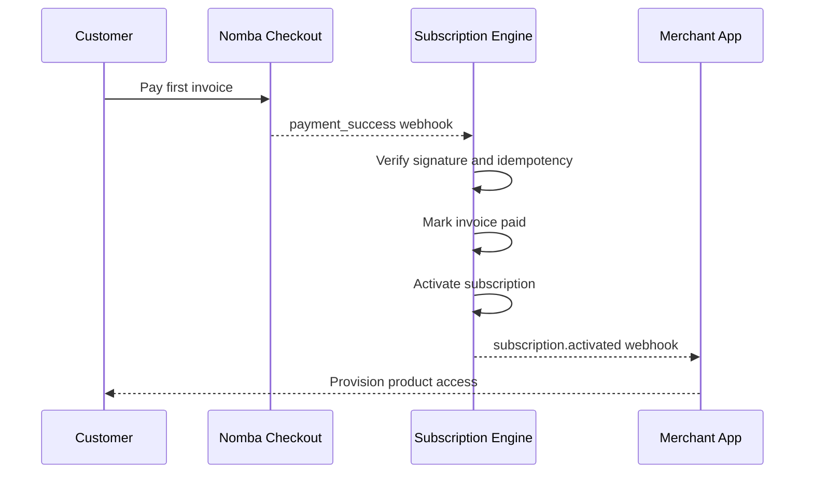
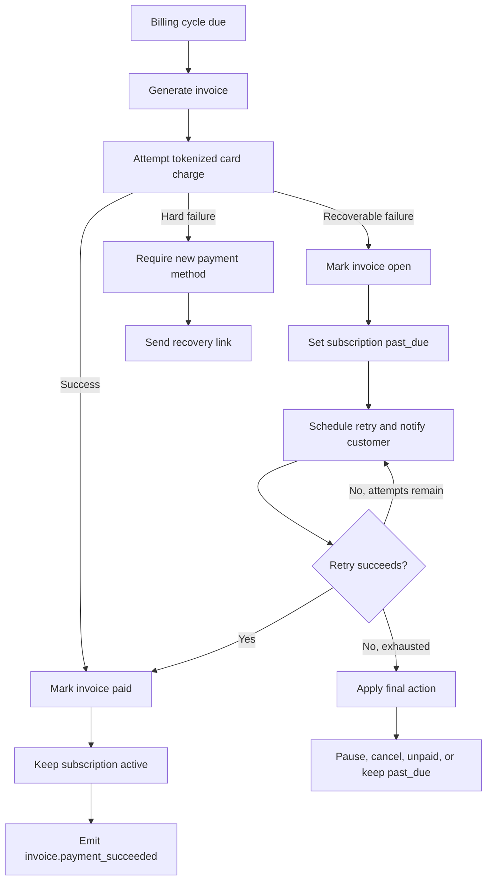
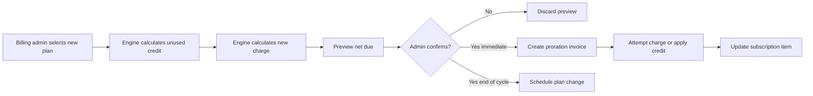
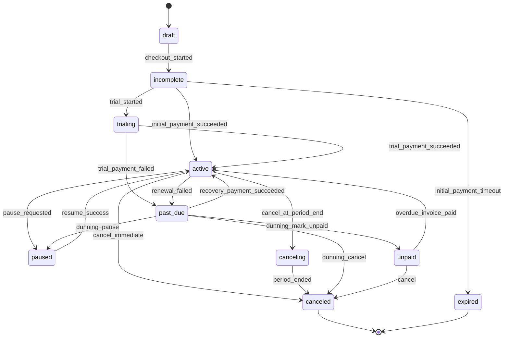

# UX Flows and Screens

## Information Architecture

```mermaid
flowchart TD
  Home[Dashboard Home]
  Plans[Plans]
  Subs[Subscriptions]
  Customers[Customers]
  Invoices[Invoices]
  Recovery[Recovery Queue]
  Developers[Developers]
  Settings[Settings]
  Portal[Customer Portal]

  Home --> Plans
  Home --> Subs
  Home --> Invoices
  Home --> Recovery
  Plans --> PlanCreate[Create/Edit Plan]
  Plans --> PlanDetail[Plan Detail]
  Subs --> SubDetail[Subscription Detail]
  Customers --> CustomerDetail[Customer Timeline]
  Invoices --> InvoiceDetail[Invoice Detail]
  Recovery --> FailedInvoice[Failed Invoice Detail]
  Developers --> ApiKeys[API Keys]
  Developers --> Webhooks[Webhook Endpoints]
  Developers --> EventLogs[Event Logs]
  Settings --> Branding[Portal Branding]
  Settings --> Team[Team and Roles]
  Settings --> BillingPolicy[Billing Policies]
  Portal --> PortalPlan[Plan and Renewal]
  Portal --> PortalPayment[Payment Method]
  Portal --> PortalReceipts[Receipts]
```

## Screen Inventory

### Merchant Dashboard

Purpose: executive and operations overview.

Must show:

- Monthly recurring revenue
- Active subscriptions
- Trialing subscriptions
- Past due subscriptions
- Failed revenue at risk
- Recovery rate
- Recent billing events
- Upcoming renewals
- Quick actions: create plan, create subscription, open recovery queue

### Plans List

Purpose: manage sellable recurring packages.

Must show:

- Product and plan name
- Active/draft/archived state
- Price and interval
- Subscribers count
- Trial days
- Dunning policy
- Last updated
- Actions: edit, clone, archive, view

### Plan Builder

Purpose: create or edit a plan.

Sections:

- Basics: product, plan name, description
- Pricing: amount, currency, interval, custom interval count
- Trial and setup: trial days, setup fee
- Entitlements: feature list, limits
- Billing behavior: proration policy, cancellation policy, dunning policy
- Checkout: allowed payment methods, card tokenization, redirect URLs
- Review and activate

### Subscriptions List

Purpose: operational view of all subscriber contracts.

Must show:

- Customer
- Plan
- Status
- Current period
- Renewal date
- Latest invoice status
- Payment method summary
- MRR/ARR contribution
- Filters: status, plan, date, failed payment, trial ending

### Subscription Detail

Purpose: support, billing, and lifecycle control.

Sections:

- Status header and key dates
- Customer and payment method
- Current plan and price
- Timeline
- Invoices
- Payment attempts
- Entitlements
- Actions: retry payment, change plan, pause, resume, cancel, send recovery link

### Recovery Queue

Purpose: central dunning operations.

Must show:

- Failed invoices ordered by revenue at risk and next action
- Failure reason
- Attempt count
- Next retry
- Customer notification state
- Recovery link status
- Bulk actions: resend links, pause retries, export

### Developer Console

Purpose: API adoption.

Must show:

- Environment switcher: test/live
- API keys
- Webhook endpoints
- Recent events
- Webhook delivery attempts
- Event replay
- Sample payloads
- Idempotency guide

### Customer Portal

Purpose: reduce merchant support load.

Must show:

- Brand header
- Current plan and renewal date
- Payment method summary
- Overdue invoice warning
- Update payment method
- Pay invoice
- Change plan if allowed
- Cancel or pause if allowed
- Invoice receipts

## Merchant First-Run Flow

## Customer Activation Flow

## Renewal and Dunning Flow

## Proration Change Flow

## Subscription State Machine

## Design Intent

The UI should feel like a serious finance operations product:

- Dense but readable information.
- Tables, filters, status badges, timelines, and focused action panels.
- Minimal decoration.
- Calm neutral base with Signal Teal as a purposeful action color.
- Clear separation between safe actions, destructive actions, and irreversible billing changes.
